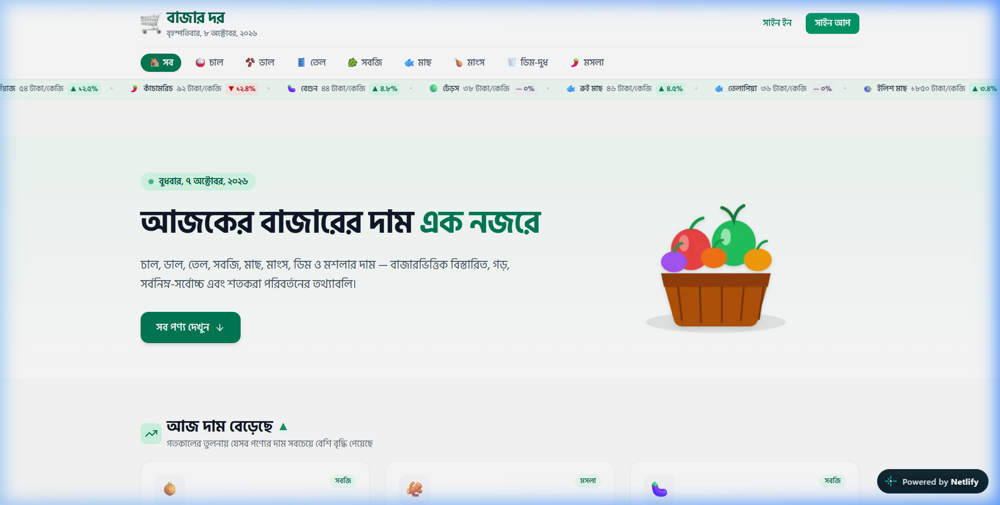
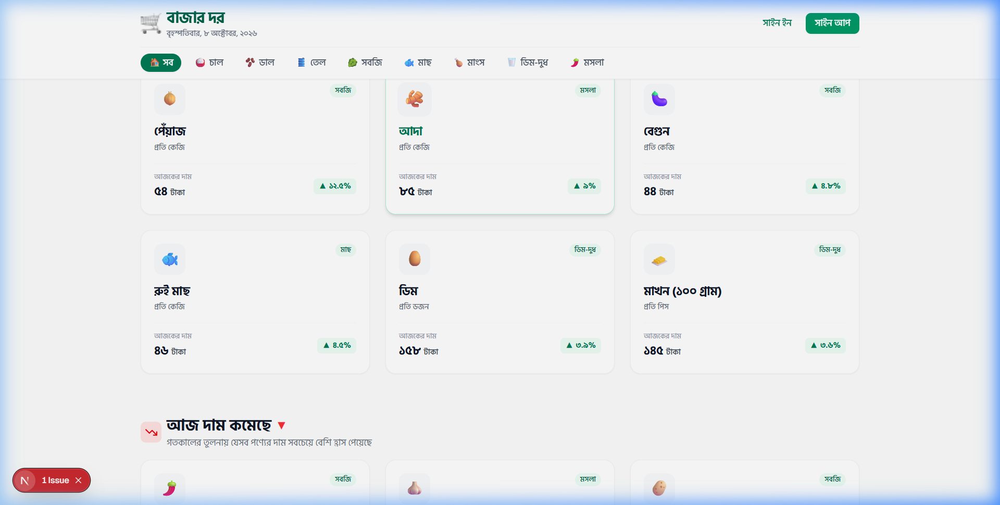
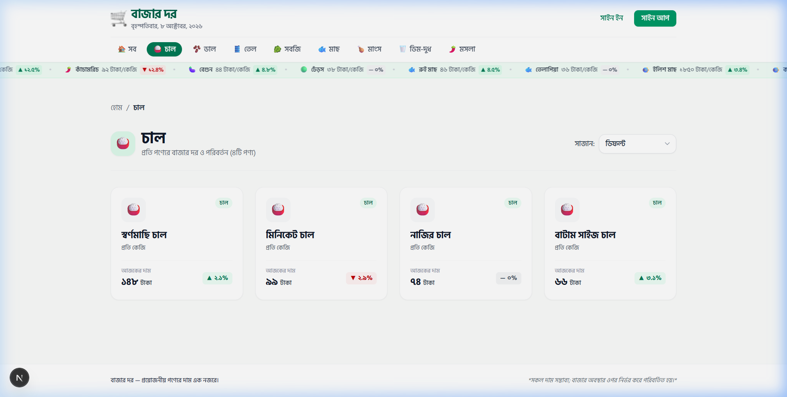
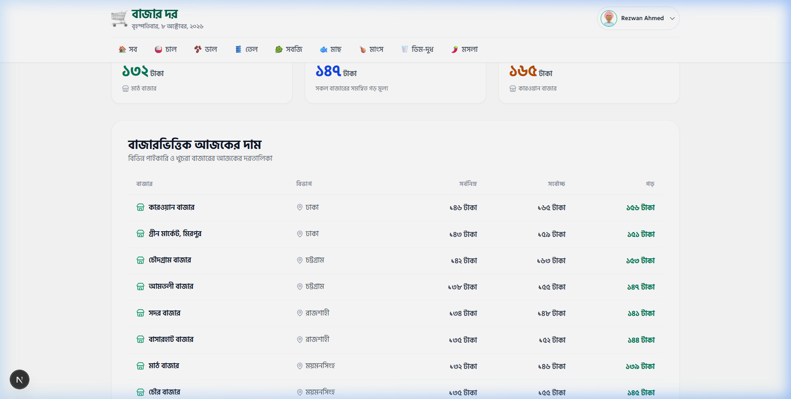
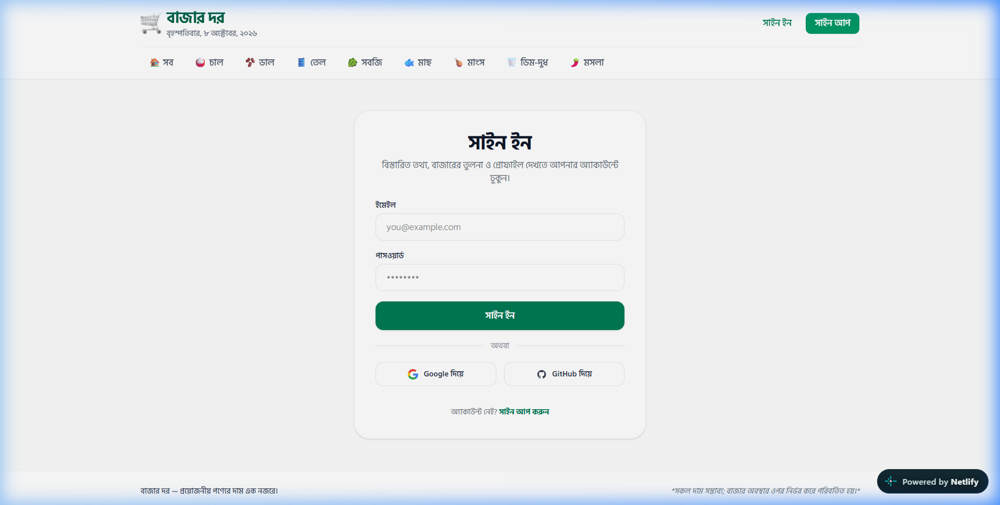
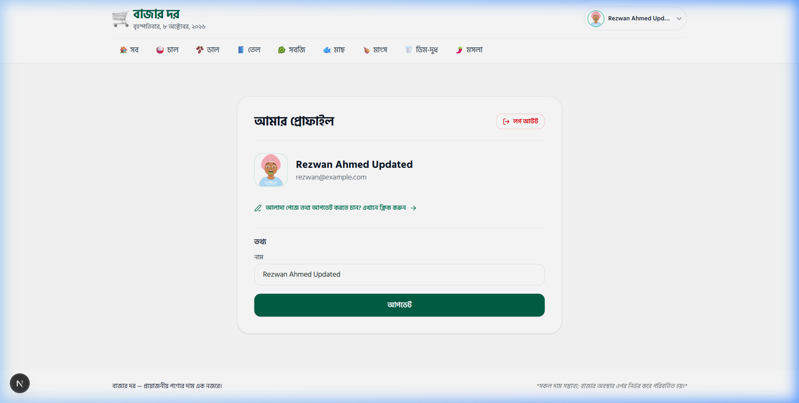
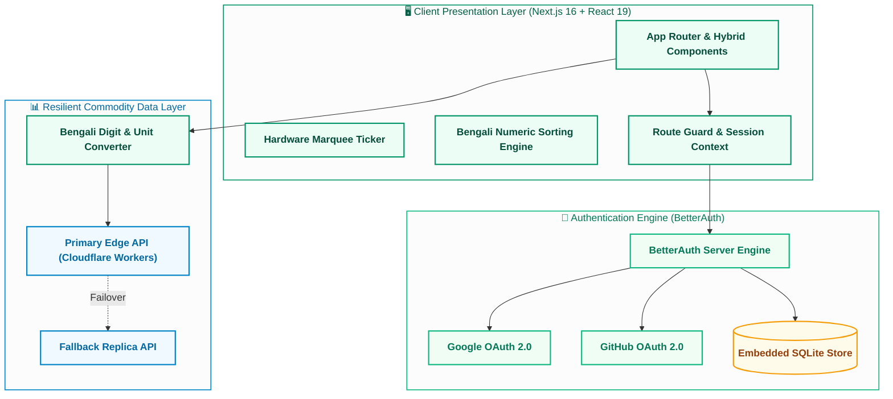

<div align="center">

# 🛒 বাজার দর (BazarDor)
### ⚡ Real-Time Commodity Price Intelligence & Market Analytics Platform
**নিত্যপ্রয়োজনীয় পণ্যের বাজার দর ট্র্যাকিং • বহু-বাজারভিত্তিক মূল্য তুলনা • স্বচ্ছ ভোক্তা প্ল্যাটফর্ম**

<br />

<a href="https://bazar-d0r.netlify.app/">
  
</a>

<br />

[](https://nextjs.org/)
[](https://react.dev/)
[](https://www.typescriptlang.org/)
[](https://tailwindcss.com/)
[](https://better-auth.com/)
[](https://bazar-d0r.netlify.app/)
[](https://opensource.org/licenses/MIT)

<br />

[](https://bazar-d0r.netlify.app/)

<p align="center">
  <a href="#-application-preview">📸 App Showcase</a> •
  <a href="#-key-features">✨ Core Features</a> •
  <a href="#-system-architecture">🏛️ Architecture</a> •
  <a href="#-tech-stack">🛠️ Tech Stack</a> •
  <a href="#-getting-started">🚀 Quick Start</a> •
  <a href="#-security--performance">🔒 Security</a> •
  <a href="#-api-documentation">🔌 API Reference</a>
</p>

---

</div>

## 📸 Application Preview

<div align="center">

| 🏠 **Landing Page & Infinite Price Ticker** | 📈 **Daily Risers & Fallers Analysis** |
| :---: | :---: |
|  |  |

| 🏷️ **Category Filter & Numeric Sorting** | 📊 **Multi-Market Breakdown & Statistics** |
| :---: | :---: |
|  |  |

| 🔐 **OAuth 2.0 (Google & GitHub) Authentication** | 👤 **Self-Service Profile Customization** |
| :---: | :---: |
|  |  |

</div>

---

## 📌 Executive Overview

**BazarDor (বাজার দর)** is a high-performance web platform designed to eliminate price asymmetry across Bangladesh's agricultural and consumer commodity markets. By systematically ingesting, comparing, and tracking real-time market data across prime wholesale and retail trading hubs (such as Karwan Bazar, Mirpur-1, New Market, and Shantinagar), BazarDor empowers households, restaurant operators, and traders to make data-backed purchasing decisions.

### 🎯 Key Value Propositions
* 🟢 **Price Transparency**: Compare identical commodities across multiple physical bazaars within seconds.
* ⚡ **Market Velocity**: Real-time identification of volatility with daily percentage deltas (`▲ আজ দাম বেড়েছে`, `▼ আজ দাম কমেছে`).
* 🇧🇩 **Localized Accessibility**: 100% native Bengali numerical collation, Hind Siliguri typography, and cultural shopping ergonomics.
* 🛡️ **Enterprise Security**: Production-grade BetterAuth engine supporting Google & GitHub OAuth 2.0 with zero credential leaks.

---

## ✨ Key Features & Innovations

### 1. 🔴 Hardware-Accelerated Marquee Ticker
* ⚡ **Continuous Stream**: High-visibility ribbon flowing across the top viewport detailing commodity changes: `[আইকন] [নাম] আজকের দাম [টাকা]/[একক] [▲/▼ %]`.
* ⏸️ **Intelligent Hover Pause**: Automatically pauses marquee motion when hovered for convenient price reading.

### 2. 📈 Daily Price Velocity Engine (Risers & Fallers)
* 🟢 **▲ Top Risers (আজ দাম বেড়েছে)**: Highlights commodities experiencing highest upward price pressure over 24h.
* 🔴 **▼ Top Fallers (আজ দাম কমেছে)**: Highlights discounted commodities, helping consumers optimize grocery expenditure.

### 3. 📊 Deep Multi-Market Comparative Analytics
* 💎 **Statistical KPI Cards**: Live dynamic calculation of **Minimum Price**, **Average Market Price**, and **Maximum Price** across all tracked locations.
* 🏬 **Best Market Indicator**: Automatically badges the lowest-priced market for any selected item.
* 📋 **Interactive Breakdown Table**: Tabular breakdown contrasting wholesale and retail rates across Karwan Bazar, Mirpur, Shantinagar, New Market, etc.

### 4. 🏷️ Native Bengali Numerical Sorting Engine
* 🗂️ **Categorical Segmentation**: Quick filtering across Rice, Lentils, Edible Oils, Vegetables, Fish, Meat, Eggs/Dairy, and Spices.
* 🔢 **Unicode-Safe Sorting**: Algorithms normalize and evaluate Bengali numeral characters (`০-৯`) into native IEEE double-precision floats:
  * 🔄 `ডিফল্ট (Default)`
  * 📉 `দাম: কম থেকে বেশি (Price: Low to High)`
  * 📈 `দাম: বেশি থেকে কম (Price: High to Low)`
* 💀 **Fluid Skeleton Loading**: Shimmering feedback loaders preventing layout shifts during network transitions.

### 5. 🔐 Enterprise Authentication & Profile Management
* 🔑 **Dual-Mode Authentication**: Seamless email/password accounts alongside one-click **Google** and **GitHub OAuth 2.0**.
* 🛡️ **Context-Aware Route Guards**: Unauthenticated users visiting protected analytics are redirected to `/signin` with toast alerts and return URL preservation.
* ✏️ **Self-Service Profile Customization**: Users can update their profile information with instantaneous propagation across session states.

### 6. 📱 Ergonomic Responsive Design & Typography
* 🎨 **Tailwind CSS v4 Design Tokens**: Fluid responsive layouts tailored for mobile, tablet, and 4K viewports.
* 🔤 **Hind Siliguri Font**: Precision typography curated for maximum Bengali readability.
* 🔍 **Branded 404 Recovery**: Custom Bengali error screen preventing dead-end user journeys.

---

## 🏛️ System Architecture



---

## 🛠️ Tech Stack & Ecosystem

<div align="center">

<a href="https://skillicons.dev">
  
</a>

<br /><br />

<p align="center">
  
  
  
  
</p>

</div>

<br />

| Domain / Layer | Technology | Key Capabilities & Responsibility | Ecosystem Badge |
| :--- | :--- | :--- | :---: |
| ⚡ **Core Framework** | [**Next.js 16**](https://nextjs.org/) | App Router, Turbopack Bundler, Server/Client Hybrid Components | [](https://nextjs.org/) |
| ⚛️ **UI Library** | [**React 19**](https://react.dev/) | React Server Actions, Suspense Boundaries, use() Hook API | [](https://react.dev/) |
| 🔷 **Language** | [**TypeScript 5**](https://www.typescriptlang.org/) | Strict Compile-Time Type Safety, Shared Domain Interfaces | [](https://www.typescriptlang.org/) |
| 🎨 **Styling Engine** | [**Tailwind CSS v4**](https://tailwindcss.com/) | Modern CSS Variables, Custom Marquee Keyframes, Responsive Grid | [](https://tailwindcss.com/) |
| 🔐 **Authentication** | [**BetterAuth**](https://better-auth.com/) | Credentials Auth, Google OAuth 2.0, GitHub OAuth 2.0, Session Guard | [](https://better-auth.com/) |
| 🗄️ **Data Persistence** | [**Better-SQLite3**](https://github.com/WiseLibs/better-sqlite3) | Serverless-Compatible Embedded SQLite Session & User Store | [](https://sqlite.org/) |
| 🌐 **Cloud Hosting** | [**Netlify Edge**](https://www.netlify.com/) | Serverless Edge Network, Instant Invalidation, Automated CI/CD | [](https://www.netlify.com/) |
| 💎 **Iconography** | [**Lucide React**](https://lucide.dev/) | Ultra-Lightweight Pixel-Perfect Vector Icon Library | [](https://lucide.dev/) |
| 🔔 **Notifications** | [**React Hot Toast**](https://react-hot-toast.com/) | Accessible, Non-Blocking Interactive User Toast Notifications | [](https://react-hot-toast.com/) |

---

## 📂 Project Architecture

<div align="center">

<p align="center">
  
  
  
  
</p>

</div>

<br />

### 🧩 Architectural Domain Breakdown

| Module / Directory | Primary Responsibility | Key Files & Artifacts | Architectural Highlight |
| :--- | :--- | :--- | :--- |
| 🌐 **`src/app/`** | **App Router Pages & Views** | `page.tsx`, `layout.tsx`, `not-found.tsx` | Server/Client hybrid rendering with React 19 concurrent boundaries |
| 🔐 **`src/app/api/auth/`** | **BetterAuth API Gateway** | `[...all]/route.ts` | Serverless catch-all handler for credentials and OAuth 2.0 callbacks |
| 🏷️ **`src/app/categories/`** | **Dynamic Category Catalog** | `[slug]/page.tsx` | Parametric routing with native Bengali numeral numeric price sorting |
| 📊 **`src/app/product/`** | **Protected Analytics View** | `[id]/page.tsx` | Route-guarded comparative market tables and KPI statistics |
| 👤 **`src/app/profile/`** | **Account & Identity Hub** | `page.tsx`, `update/page.tsx` | Self-service profile management with live session state reflection |
| 🧩 **`src/components/`** | **Modular UI Component Library** | `Navbar`, `PriceTicker`, `ProductCard` | Micro-interaction hover cards and hardware-accelerated marquee ticker |
| 🛡️ **`src/context/`** | **Global State Management** | `AuthContext.tsx` | Persistent multi-tab auth session provider and toast notification dispatch |
| ⚙️ **`src/lib/`** | **Core Services & Utilities** | `api.ts`, `auth.ts`, `utils.ts` | Dual-replica failover API client and Bengali numeral converter |
| 📐 **`src/types/`** | **Domain Type Definitions** | `index.ts` | Strict TypeScript domain contracts (`Product`, `Category`, `User`) |
| 🖼️ **`public/`** | **Static CDN Assets** | `hero.png`, `favicon.ico`, `screenshots/` | Optimized responsive images and application showcase media |
| 🔧 **Configuration** | **Infrastructure & Tooling** | `netlify.toml`, `next.config.ts` | Turbopack loaders, HTTP security headers, and automated CI/CD |

<br />

<details>
<summary><strong>📁 Click to Expand Full Directory Tree Structure</strong></summary>

```bash
bazar-dor/
├── public/                       # Static public assets & documentation media
│   ├── bazar-hero.png            # Hero visual artwork
│   ├── favicon.ico               # Branded application favicon
│   └── screenshots/              # High-resolution application preview images
│       ├── hero-preview.png      # Hero & marquee ticker showcase
│       ├── risers-fallers.png    # Top 6 risers & fallers display
│       ├── category-sort.png     # Category filtering & numeric sort
│       ├── product-details.png   # Multi-bazaar breakdown table
│       ├── auth-preview.png      # Google & GitHub OAuth interface
│       └── profile-preview.png   # Profile view & in-app name update
├── src/
│   ├── app/                      # Next.js App Router root
│   │   ├── api/auth/[...all]/    # BetterAuth serverless API catch-all
│   │   ├── categories/[slug]/    # Category catalog with numeric price sorting
│   │   ├── product/[id]/         # Protected product details & market breakdown
│   │   ├── profile/              # User profile & account overview
│   │   │   └── update/           # Self-service profile editing
│   │   ├── signin/               # Authentication entry point
│   │   ├── signup/               # New user onboarding
│   │   ├── globals.css           # Global CSS variables, animations & marquee
│   │   ├── layout.tsx            # Root layout, fonts & toast container
│   │   ├── not-found.tsx         # Custom branded Bengali 404 error page
│   │   └── page.tsx              # Home page (Hero, Risers, Fallers, Grid)
│   ├── components/               # Reusable UI component modules
│   │   ├── Footer.tsx            # Footer navigation & copyright
│   │   ├── HeroBanner.tsx        # Hero banner with dynamic search triggers
│   │   ├── Navbar.tsx            # Navigation bar & authentication state
│   │   ├── PriceTicker.tsx       # Infinite continuous marquee ticker
│   │   ├── ProductCard.tsx       # Commodity card with micro-interaction hover
│   │   └── ProductSkeleton.tsx   # Shimmering loading placeholders
│   ├── context/                  # React Context providers
│   │   └── AuthContext.tsx       # Global authentication state provider
│   ├── lib/                      # Core business logic & utility modules
│   │   ├── api.ts                # Fault-tolerant commodity data service
│   │   ├── auth-client.ts        # Client-side BetterAuth connector
│   │   ├── auth.ts               # Server-side BetterAuth configuration
│   │   └── utils.ts              # Bengali numeral & unit localization engine
│   └── types/                    # Shared TypeScript interfaces & types
│       └── index.ts
├── netlify.toml                  # Netlify deployment configuration
├── next.config.ts                # Next.js bundler & HTTP security headers
├── package.json
└── README.md
```

</details>

---

## 🚀 Getting Started

Follow these steps to clone, configure, and launch the platform locally:

### 1. Prerequisites
* **Node.js**: `v20.x` or higher installed
* **Package Manager**: `npm`, `yarn`, or `pnpm`

### 2. Clone Repository
```bash
git clone https://github.com/mahfuzhasan2700/Bazar-Dor.git
cd Bazar-Dor
```

### 3. Install Dependencies
```bash
npm install
```

### 4. Configure Environment
Create a `.env.local` file from the example template:
```bash
cp .env.example .env.local
```

Populate the configuration variables:
```env
# BetterAuth Core
BETTER_AUTH_SECRET=your_secure_random_key_here
BETTER_AUTH_URL=http://localhost:3000

# GitHub OAuth (https://github.com/settings/developers)
GITHUB_CLIENT_ID=your_github_client_id
GITHUB_CLIENT_SECRET=your_github_client_secret

# Google OAuth (https://console.cloud.google.com/apis/credentials)
GOOGLE_CLIENT_ID=your_google_client_id
GOOGLE_CLIENT_SECRET=your_google_client_secret
```

### 5. Launch Development Server
```bash
npm run dev
```
Open **[http://localhost:3000](http://localhost:3000)** in your browser.

### 6. Production Bundle Build
```bash
npm run build
npm run start
```

---

## 🔒 Security & Performance Engineering

* 🛡️ **Zero Secret Exposure**: No credential variables are prefixed with `NEXT_PUBLIC_`. All OAuth exchange secrets remain isolated within serverless runtimes.
* 🌐 **Comprehensive HTTP Security Headers**: Built-in protection configured in `next.config.ts`:
  * `X-Frame-Options: SAMEORIGIN` (Clickjacking mitigation)
  * `X-Content-Type-Options: nosniff` (MIME sniffing prevention)
  * `Referrer-Policy: strict-origin-when-cross-origin`
  * `Permissions-Policy: camera=(), microphone=(), geolocation=()`
  * `Strict-Transport-Security: max-age=31536000; includeSubDomains; preload`
* 🍪 **Hardened Session Cookies**: BetterAuth session cookies default to `HttpOnly`, `SameSite: Lax`, and mandatory `Secure` flags on HTTPS.
* 🔄 **Failover Resilience**: The data client automatically routes queries to a fallback Cloudflare Workers replica upon detecting upstream errors.

---

## 🔌 API Documentation

| Method | Route | Description |
| :--- | :--- | :--- |
| `GET` | `/categories` | Fetches all commodity category metadata |
| `GET` | `/categories/:slug` | Retrieves details for a given category |
| `GET` | `/products` | Retrieves all commodities with daily price trends |
| `GET` | `/products?category=:slug` | Filters products by category identifier |
| `GET` | `/products/:id` | Returns product details with comparative bazaar breakdown |
| `POST`| `/api/auth/sign-in/email` | Authenticates user via email and password |
| `POST`| `/api/auth/sign-in/social` | Initiates OAuth 2.0 handshake (Google / GitHub) |
| `GET` | `/api/auth/get-session` | Returns active BetterAuth session payload |

---

## 📄 License

This project is licensed under the [MIT License](https://opensource.org/licenses/MIT).

<br />

<div align="center">

### 🛒 বাজার দর (BazarDor)
<sub>Engineered with passion for transparency and accessibility in daily commerce.</sub>

<br />

[](https://bazar-d0r.netlify.app/)
[](https://github.com/mahfuzhasan2700/Bazar-Dor)

</div>
